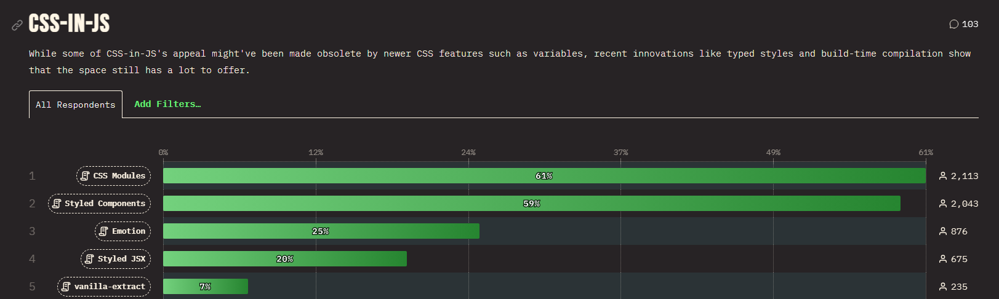

# CSS 알아보기


### CSS Preprocessor

- CSS 전처리기
    - 재사용성 - 공통 요소 또는 반복적인 항목을 변수 또는 함수로 대체
    - 유지 관리 - 중첩/상속과 같은 요소로 인해 구조화된 코드로 유지 및 관리가 용이
    - 비교
        - css
            
            ```css
            $primary-color: #fff
            
            .class-A 
                background-color: $primary-color
            
            .class-B 
                background-color: $primary-color
            ```
            
        - 전처리기 사용 시
            
            ```sass
            $color: #2ecc71
            $buttonDark: darken($buttonColor, 10%)
            
            button 
                background: $color
                box-shadow: 0px 5px 0px $buttonDark
            ```
            
- Sass
    - 특징
        - CSS와 유사하지만 별도의 문법 변수, 믹스인(mixin) 등의 개념이 존재함.
        - 재사용성을 높일 수 있음.
        - 별도의 빌드 단계를 거쳐 CSS 파일로 변환됨.
    - 종류
        - SASS = Syntatically Awesome Style Sheets
            - 작성하기 편리하며 간결함.
            - 중괄호 혹은 세미콜론이 요구되지 않음.
            
            ```sass
            .list
              width: 100px
              float: left
              li
                color: red
                background: url("./image.jpg")
                &:last-child
                  margin-right: -10px
            ```
            
        - SCSS = Sassy CSS
            - 한 줄로 인라인 코드 작성 가능
            - CSS와 유사한 문법을 가지고 있어 코드 통합이 더 쉬움.
            - CSS와 거의 유사한 문법으로 Sass 기능을 지원.
            
            ```scss
            .list {
              width: 100px;
              float: left;
              li {
                color: red;
                background: url("./image.jpg");
                &:last-child {
                  margin-right: -10px;
                }
              }
            }
            ```
    - Less
        - Bootstrap에서 사용되면서 전파 되었다.
        - Node.js기반 구동 > 초기에는 Sass보다 컴파일 속도가 빨랐으나 현재는 비슷하다.
        
        ```less
        .list {
          width: 100px;
          float: left;
        
          li {
            color: red;
            background: url("./image.jpg");
        
            &:last-child {
              margin-right: -10px;
            }
          }
        }
        
        ```
        
    - Stylus
        - Node.js기반 구동
        - 가장 최근에 나온 전처리
        
        ```less
        .list
          width 100px
          float left
        
          li
            color red
            background url("./image.jpg")
            
            &:last-child
              margin-right -10px
        
        ```
        

### CSS-in-js

- css-in-js
    
    
    
    - 특징
        - CSS 코드를 자바스크립트 파일에서 작성
        - js 내에서 관리하기 때문에 내부 응집도 올라감
            - 동적으로 CSS 변경도 쉬움.
    - 종류
        - styled-components
            - 손쉬운 유지보수
            - 고유한 CSS 클래스명을 생성한다.
            - 동적 스타일링을 지원한다.
            - 테마를 지원한다.
            
            ```jsx
            const List = styled.ul`
              width: 100px;
              float: left;
              
              li {
                color: red;
                background: url("./image.jpg");
                
                &:last-child {
                  margin-right: -10px;
                }
              }
            `;
            ```
            
        - emotion
            - 경량화된 라이브러리로 빠른 런타임 성능을 제공한다.
            - 스타일링 방식이 유연하다.
            - 테마를 지원한다.
            - SSR을 일부 지원한다.
            - styled component와 유사한 문법을 제공한다.
            
            ```jsx
            const List = styled.ul`
              width: 100px;
              float: left;
            
              li {
                color: red;
                background: url('./image.jpg');
            
                &:last-child {
                  margin-right: -10px;
                }
              }
            `;
            ```
            

---
### 참고자료
https://velog.io/@gygy/Sass-css-in-js-css-module
https://www.samsungsds.com/kr/insights/web_component.html
https://dev.to/fyapy/sass-vs-css-modules-vs-css-in-js-vs-compile-time-css-in-js-who-wins-4cl
https://velog.io/@seul06/React-Component-Styling
https://medium.com/dailyjs/what-is-actually-css-in-js-f2f529a2757
https://emotion.sh/docs/ssr
https://dev.to/fyapy/sass-vs-css-modules-vs-css-in-js-vs-compile-time-css-in-js-who-wins-4cl
https://www.speakeasy.com/post/sass-vs-css-modules-vs-css-in-js
https://fathory.tistory.com/30
https://kdydesign.github.io/2019/05/12/css-preprocessor/
https://stylus-lang.com/
https://github.com/css-modules/css-modules
