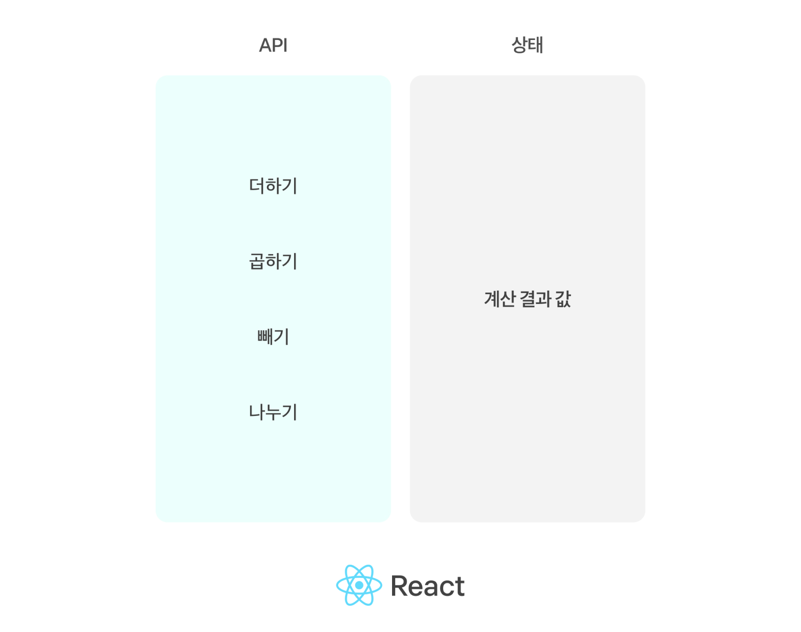
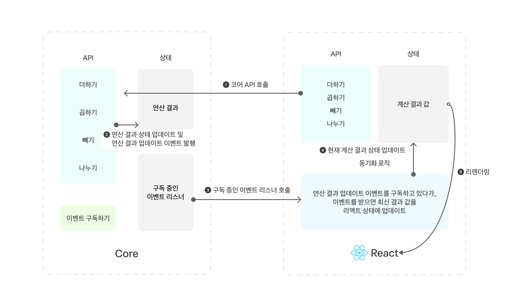

# Framework Agnostic

* Agnostic
    * 소프트웨어가 특정 환경에 독립적으로 설계 되었다는 속성
    * 환경에 독립적으로 설계 되었다는 것은 운영체제, 하드웨어 플랫폼, 프로그램이 언어 등에 독립적으로 설계되었음을 의미함.

* Framework Agnostic
    * 프론트엔드 개발 관점에서 보았을 때의 의미
        * React, Vue와 같은 웹 프레임워크 혹은 라이브러리에 상관 없이 의도된 동작이 실행되도록 설계된 것


* Framework Agnostic의 예시
    * Tanstack Query
        : 기존 React Query가 v4부터 이름을 바꾸고 Framework Agnostic한 라이브러리가 됨.
        ```
        TanStack Query (FKA React Query) is often described as the missing data-fetching library for web applications, but in more technical terms, it makes fetching, caching, synchronizing and updating server state in your web applications a breeze.
        ```

* Tanstack Query의 레포지토리 구성

  https://github.com/TanStack/query/tree/main/packages

    * query-core
    * react-query
    * svelte-query
    * vue-query

    -> 핵심 로직과 Framework 의존성이 있는 패키지를 분리함.

    * 코어와 어댑터 개념
        * 코어 `query-core`
            : 프레임워크에 종속적이지 않은 핵심 로직이 들어있음.
        * 어댑터 `react-query`, `vue-query`...
            : 코어의 인터페이스를 활용해 해당 기능을 프레임워크에서 이용할 수 있도록 통합.
    
    * 장단점
        * 코어 변경 없이 새로운 프레임워크 추가 및 업데이트 가능
        * 독립적 개발 및 유지보수로 개발 효율성 향상.

        * 어댑터는 프레임워크에 종속적이기 때문에 수정 및 테스트가 프레임워크의 업데이트마다 요구됨.

* 설계 예시
    * 기존 react-query와 같은 방식

        

    * agnostic한 형태로 변경

        

    * 이벤트를 분리하여 코어에서 발생시킨다. 어댑터는 코어에서 발생한 이벤트를 구독하고 React/Vue 등 각각 담당하는 Framework의 상태를 업데이틀 하는 로직을 포함한다.
---
https://tanstack.com/query/latest
https://stackoverflow.com/questions/64725017/what-does-it-mean-by-framework-agnostic
https://j11y.io/javascript/a-framework-agnostic-model/
https://micro-frontends.org/#the-dom-is-the-api
https://toss.tech/article/framework-agnostic-library

