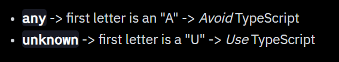
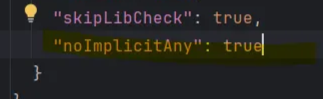
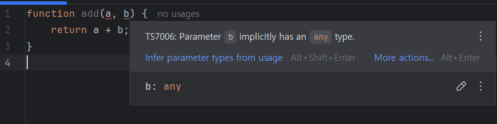
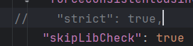
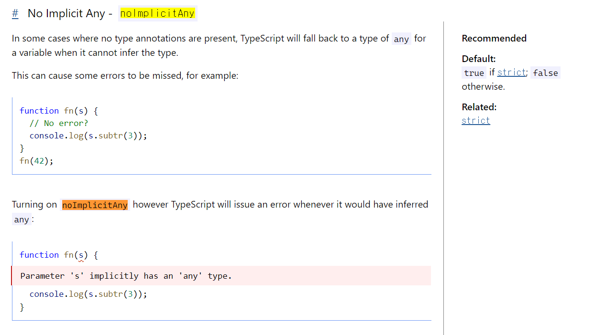

# Typescript의 Any와 Unknown


## Any는 Avoid, Unknown은 Use



any와 unknown에 대해 궁금해서 찾아보던 중 발견한 문구. 흥미로워서 조금 더 깊게 찾아보기로 했다.

### `Any` 타입

<aside>

In some situations, not all type information is available or its declaration would take an inappropriate amount of effort. These may occur for values from code that has been written without TypeScript or a 3rd party library. In these cases, we might want to opt-out of type checking. To do so, we label these values with the `any` type:

</aside>

- (구버전)공식 docs의 소개
    - 모든 타입 정보를 제공하기 어렵거나, 타입 선언에 지나치게 많은 노력이 들 때
        - typescript 없이 작성된 코드
        - 서드파티 라이브러리에서 값을 가져올 때
        
        ⇒ 타입 검사를 생략해야 함. → any 사용
        
    - 기존 javascript와 작업할 때 강력하다
        - 컴파일 시 타입 검사를 점진적으로 포함하거나 제외할 수 있게 해줌.
    - 존재하지 않는 속성에 접근하는 것도 허용
        - 함수도 포함됨.
        - Typescript는 해당 속성의 존재 여부나 타입을 검사하지 않음.
- (구버전)공식 docs 코드로 살펴보기
    - 존재하지 않는 속성에 접근하는 것도 허용
        
        ```typescript
        let looselyTyped: any = 4;
        // OK, ifItExists might exist at runtime
        looselyTyped.ifItExists();
        // OK, toFixed exists (but the compiler doesn't check)
        looselyTyped.toFixed();
        ```
        - `toFixed` 는 javascript의 `Number`타입에 사용되는 메서드
            
            ```typescript
            let num = 5.12798;
            console.log(num.toFixed(2));
            // "5.13"
            // 숫자를 받아 고정 소수점 형식의 문자열로 반환.
            ```
            
            - 즉, 대상이 `Number` 여야만 메서드가 존재함. 그러나 `looselyTyped.toFixed()` 에서는 Typescript가 해당 메서드가 존재하는지 여부를 검사하지 않음.
    - `any` 타입은 전파된다.
        
        ```typescript
        let looselyTyped: any = {};
        // 컴파일 단계에서는 any타입으로 취급됨.
        // 그러나 런타임에서 looselyTyped.a가 undefined 속성으로 판정나 오류가 남.
        let d = looselyTyped.a.b.c.d;
        ```
        
- (현버전) 공식 docs의 Any소개
    - ~~구버전보다 조금 더 유약한 형태로 소개한다.~~
    - 특정값이 타입 검사 오류를 발생시키지 않길 원할 때 사용 가능하다.
        - 값의 속성에 접근 가능
        - 함수처럼 호출 가능
        - 다른 타입의 값에 할당하거나 할당받을 수 있음.
        
        ⇒ 문법적으로 허용 되는 거의 모든 작업 수행 가능.
    ```typescript
    let obj: any = { x: 0 };
    // None of the following lines of code will throw compiler errors.
    // Using `any` disables all further type checking, and it is assumed
    // you know the environment better than TypeScript.
    obj.foo();
    obj();
    obj.bar = 100;
    obj = "hello";
    const n: number = obj;
    ```
    
    - `any` 는 특정 코드가 문제 없음을 TypeScript에 납득 시키기 위해 긴 타입을 작성하고 싶지 않을 때 유용하다.
    - 타입을 명시하지 않았고, 문맥에서 추론할 수 없는 경우 컴파일러는 기본적으로 any를 사용한다.
        
        ⇒ 이를 피하기 위해 `noImplicityAny` 컴파일러 플래그를 사용하여 암시적인 `any` 를 오류로 표시할 수 있다.
        
        
        
        tsconfig.json
        
        
        
        자동적인 any 타입 감지 후 에러 표시
        
        
        
        - tscofig의 기본 strict 모드에 `noImplicityAny`가 포함되어 있긴 하다.
            
            
            
        

---

### `unknown` 타입

<aside>

The `unknown` type represents *any* value. This is similar to the `any` type, but is safer because it’s not legal to do anything with an `unknown` value:

</aside>

- 공식 docs의 설명
    - `unknown` 타입은 ‘어떠한 값이든’ 표현한다. 이건 `any` 와 비슷하지만, 더 안전하다. 왜냐하면, `unknown` 타입으로 어떤 것이든 하는 것은 허락되지 않기 때문이다.
        
        ```typescript
        function f1(a: any) {
          a.b(); // OK
        }
        function f2(a: unknown) {
          a.b();
        'a' is of type 'unknown'. :ERROR발생함.
        }
        ```
        
    - 함수 본문에 어떤 값도 포함하지 않고 모든 값을 허용하는 함수를 설명할 수 있다.
        
        ```typescript
        function safeParse(s: string): unknown {
          return JSON.parse(s);
        }
         
        // Need to be careful with 'obj'!
        const obj = safeParse(someRandomString);
        ```
        
        ⇒ 타입을 점검하여 파싱 후 사용.
    - 타입의 메소드를 바로 사용하지 못한다. 점검이 필요하다.
      
        ``` 
        // 에러 발생 케이스
        function errorUnknown(){
        let unknownType1 : unknown = "String"
        let unknownType2 : unknown = 2
        console.log(unknownType1.toUpperCase())
        console.log(unknownType2.toFixed(2))
        } 
        
        // Type narrowing을 통한 메소드 사용법
        let unknownType1 : unknown = "String"
        let unknownType2 : unknown = 2
        
        function checkType(v : unknown){
        if(typeof v == "string"){
        console.log(v.toUpperCase())
        }
        if(typeof v == "number"){
        console.log(v.toFixed())
        }
        }
        
        checkType(unknownType1)
        checkType(unknownType2)
        


---

### `unknown` vs `any`

- `unknown` is the parent type of all other types. it's a regular type in the type system.
- `any` means "disable the type check". it's a compiler directive.
  

- `unknown` 은 다양한 타입을 받을 수 있지만 각각의 타입에 해당하는 메소드 등을 사용하진 못한다. 부모 개념과 유사하다.
- `any` 는 “타입 체크를 비활성화한다”는 것을 의미한다. 컴파일러에 대한 지시문이라고 생각할것.

---

### 참고자료

https://tomdohnal.com/posts/typescript-any-vs-unknown-a-deep-dive

https://stackoverflow.com/questions/51439843/unknown-vs-any

https://www.typescriptlang.org/docs/handbook/2/everyday-types.html

https://www.typescriptlang.org/docs/handbook/2/functions.html#unknown

https://www.typescriptlang.org/tsconfig/#strict

https://xionwcfm.tistory.com/394

https://www.typescriptlang.org/docs/handbook/type-compatibility.html#any-unknown-object-void-undefined-null-and-never-assignability

https://codingapple.com/unit/typescript-multiple-types-or-any-unknown/