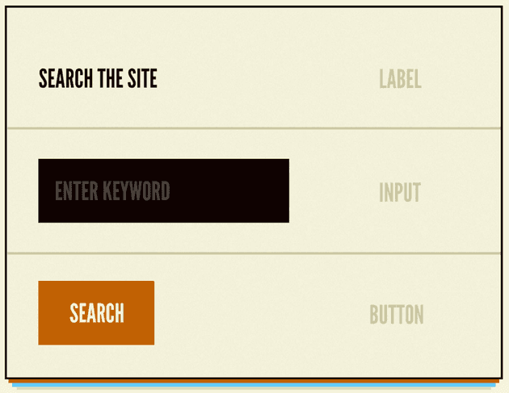
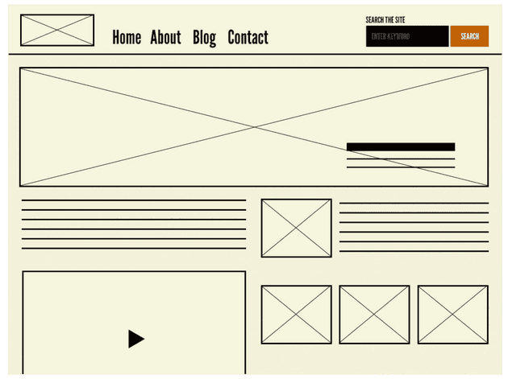

# Atomic design

Date: October 3, 2024
Status: Not started
Categories: Front-study
Tags: Frontend, 포트폴리오

# Atomic design

- Atomic design
    - 화학적 관점에서 영감을 얻은 디자인 시스템
    - 모든 것은 atom(원자)로 구성되어 있고, 모든 atom은 서로 결합하여 molecule(분자)이 되고, molecule은 더 복잡한 organism(유기체)으로 결합한다는 개념
    - `atom` → `molecule` → `organism` → `template` → `page` 레벨
        
        
        

- atom
    
    
    
    - 더 이상 분해할 수 없는 기본 컴포넌트
    - 기본 스타일을 한 눈에 보여줌
    - 추상적인 개념 또한 여기 포함 (레이아웃 등)
    - atom 간의 결합을 통해 의미를 가질 수 있음
    
- Molecule
    
    
    
    - 여러 개 atom의 결합을 통해 고유한 특성을 가짐
    - 하나의 역할을 맡음.
        - SRP(Single Responsibility Principle) 단일책임의 원칙
        - 재사용이 가능함
        - UI의 일관성을 유지함
        - 테스트가 용이해짐

- Organism
    
    
    
    - 서비스에 표현될 수 있는 명확한 영역과 특정 컨텍스트를 가짐.
    - ex) header

- Template
    
    
    
    - 여러 개의 organism, molecule로 구성 가능
    - 레이아웃 배치 및 구조화 기반 와이어프레임에 가까움

- Page
    
    
    
    - 유저가 볼 수 있는 실제 콘텐츠를 담음
    - template의 인스턴스
    

---

### React와 Atomic Design 예시

- atom
    - `Button` 컴포넌트는 `label` , `type` 이 필요하며 설계된 대로 렌더링 하고 `onclick`을 처리함.
- molecules
    - `search` 컴포넌트는 `button` 컴포넌트와 `textinput` 컴포넌트를 통해서 생성할 수 있음.
- organism
    - `Navbar` 컴포넌트는 `search` 컴포넌트, `navigation` 컴포넌트, `logo` 컴포넌트(atom)을 통해 구성할 수 있음.

---

https://medium.com/@wheeler.katia/thinking-about-react-atomically-608c865d2262

[https://github.com/diegohaz/arc](https://github.com/diegohaz/arc)

https://fe-developers.kakaoent.com/2022/220505-how-page-part-use-atomic-design-system/