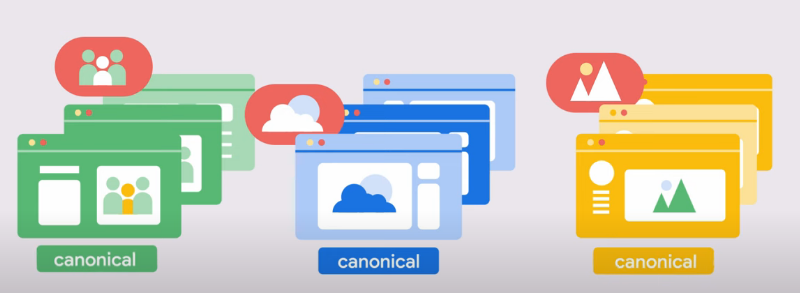
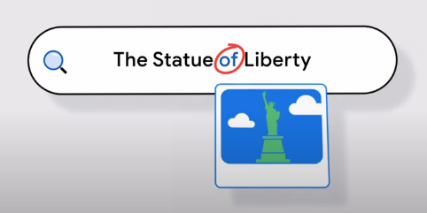
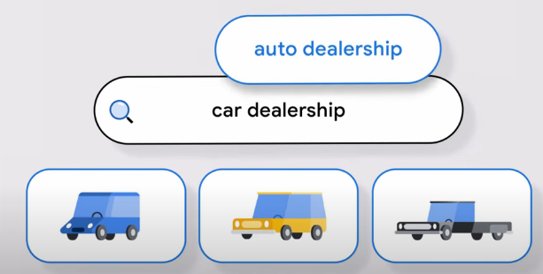
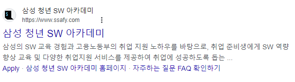

# 구글 검색의 원리

- 검색의 원리
    - 검색엔진에서 검색이 되기 위한 조건
        - 색인이 생성될 것 / 이를 기반 해 상위에 노출 될 수 있어야할 것
    - 검색엔진에서 색인을 파악하는 방법은 무엇일까?
    
- 기술적 관점에서의 원리 소개를 위한 개념 이해
    - 크롤링 : URL 발견과 인터넷 탐색 방법
    - indexing(색인) : 페이지가 어떤 페이지인지, 어떤 관계에 있는지 파악하고 정보를 저장하는 것
    - serving(게재) : 실제 결과에 대해 파악하고 제공하는 방식
    - Anatomy of a search result

- 두 가지 우선을 이해해야 한다
    - 구글은 검색 상위 노출에 대해 돈을 받지 않는다.
    - 검색 시 상단 노출은 페이지 콘텐츠의 품질에 따라 달라진다.
        - 의미없는 텍스트가 많으면 제대로 노출되지 않는다.

---

### Google 검색의 페이지 크롤링 방법

- Crawling 크롤링
    - 새로운 웹페이지나 업데이트 된 웹페이지를 찾는 과정
    - 크롤러 = 자동 프로그램이 탐색함
    - URL 탐색
        - google은 새로운 웹 페이지를 지속적으로 탐색함.
        - 당연하게도 발견되지 않는 페이지도 존재
        - 알려진 페이지에서 새로운 페이지로 이동하는 경우가 많음.
    - 크롤러
        - 인터넷 탐색 프로그램
        - 웹페이지를 다운로드한 뒤 다시 다운로드 할 수 있는 링크 추출
        - 사람이 통제하지 않는 자동화된 브라우저라고 보면 된다.
            - 기존 브라우저 = FE 정적 파일을 받아서 뿌려줌.
        - Googlebot (메인 크롤러)
            - 알고리즘에 기반해
                - 어떤 사이트를 크롤링 할 것인가?
                - 얼마나 자주 가져올 것인가?
            - 과부하를 방지하기 위해 크롤링 속도도 조절되고 있음.
                - 웹페이지 반응 속도
                - 컨텐츠 퀄리티
                - 잠재적 서버오류 신호 등
                
                위의 값에 따라 속도가 달라짐.
                
            - 모든 URL을 탐색하지 않는다.
                - 품질 이슈
                - 어떤 사이트는 탐색을 막기도 함
                - 로그인이 필요하기도 함
                
                ⇒ 공개적으로 액세스 가능한 URL만 크롤링함.

            - URL 발견 → 다운로딩 → 호스팅 되는 페이지 랜더링
                - Rendering - 브라우저가 제공하는 방식과 유사하게 작동
                    - HTML, CSS, Javascript 등을 포함함.
                    - 크롬에서 실행 가능한 자바스크립트를 실행한다.
                        - 스크롤링 텍스트 등을 볼 수 없기 때문에 JS를 실행하는 형태로 크롤링함.
                      
    - Sitemap(사이트맵)
        - XML
            - 메타데이터 제공 방식
        - 필수는 아니지만, 어떠한 검색엔진에 기반하더라도 이러한 사이트맵은 굉장히 도움이 됨.
        - 사이트를 탐색하고 생성해주는 서비스를 이용하는 걸 추천 (직접 등록시 부정확할 수 있음.)

---

### Google 검색의 페이지 색인 생성 방법

- indexing
    - 이 사이트가 무엇인지 확인하여 정보 값을 정리하는 것
    - 텍스트 콘텐츠, 주요 콘텐츠 색인 속성, 이미지, 비디오 처리 등 순위를 매길 때 사용할 수 있는 표시들을 찾음.

- HTML 태그
    - meta data
    - link

  ⇒ 무의미한 태그를 사용할 경우 앞의 모든 유의미한 자료도 탐색에서 제외

- 이미 알고 있는 url인가?
    - canonical version (표준 버전 선택)
        - 중복 페이지에서 가장 대표성을 가진다고 판단한 페이지
          - 중복 페이지 예시
            * 동일한 내용을 다른 언어로 노출
            * 동일한 컨텐츠를 모바일, 데스크탑 버전으로 노출
        - 구글은 대체로 이것만 노출 시킴
    - 페이지의 콘텐츠를 파악하고 → 유사 페이지와 모음

      = duplicate clustering

      

      → 이후 canonical을 찾음.

      `rel = canonical` 과 같은 형태는 유의미함.

        - 구체적인 페이지를 검색할때 cluster 내부에 있는 페이지를 참고하여 노출함.
        - ex) 모바일 기기에서 접근하면 cluster의 canonical이 아닌 서브페이지여도, 모바일용으로 구성한 페이지를 우선 제공한다.
        - ex) 사용자의 언어에 따라 서브 페이지를 제공한다.

- index Selection
    - 신호 수집  & 중복 페이지 취합 후 index할지 결정하는 과정
    - 페이지의 퀄리티와 수집 신호를 기반으로 이루어짐
        - 페이지에 대해 저장된 값을 google index에 저장함 (일종의 DB임)
        - 검색하면 관계성 높은 자료를 index에서 찾아주는거임.

---
---

### Google 검색의 Serving 방법

- 검색어 정리
    - 불필요한 단어 삭제

      

      

        - 단, 유의미한 단어는 구분할것

          

            - of는 유의미함
            - Statue of Liberty는 하나의 객체로 인식

    - 비슷한 단어를 포함하도록 확장

      

    ⇒ 결정된 검색어를 기반으로 대량의 데이터 확

- Ranking
    - 관련성을 결정하는 요소는 굉장히 다양함
        - 사용자 위치, 언어, 기기 유형
        - 페이지의 퀄리티와 사이즈
            - 콘텐츠의 독창성
            - 페이지의 상대적인 중요성

          ⇒ 이런 부분을 복합적으로 고려함.

    - 단, 콘텐츠가 제일 중요하긴 함.

    - 사용자가 어떤 검색어를 입력하냐에 따라 ranking 구성이 달라짐

---

### Anatomy of a Search Result

- 텍스트 결과
    - Title(bluelink - 하이퍼링크)

      

        - 페이지 콘텐츠를 기준으로 생성
        - `<title> </title>` 주로 이것과 같음.
        - 아니면 페이지의 주제를 기반으로 설정하기도 하고
        - robot.txt가 불가능하다면 `` 가 연결된 버튼의 텍스트로 연결하기도.
    - 스니펫
        - 페이지의 콘텐츠에서 가져옴
        - 콘텐츠에 접근이 안되면, 스니펫에 내용이 없을 수도 있음.
        - 주로 페이지에 표시되는 값으로 노출되나, 이미지의 대체 텍스트 등이 노출될 수 있음.
        - meta태그의 name과 content을 사용해 스니펫을 조절할 수 있음.
    - 파비콘, url 등
        - URL을 변경해 탐색 경로 바꾸기
        - 구조 데이터 변경하기
        - 새로운 파비콘 업로드 하기

      ⇒ 다양한 방식으로 검색 화면 변경 가능.

    - 사이트 링크
        - 여러 개의 링크를 하위로 모아둔 케이스
        - 내부 탐색의 쉬운 접근을 위해 구성

      

---

https://developers.google.com/search/docs/fundamentals/seo-starter-guide?hl=ko

https://developers.google.com/search/docs/fundamentals/how-search-works?hl=ko

https://www.youtube.com/watch?v=5MIAugQ17ks&list=PLKoqnv2vTMUN83JWBNM6MoBuBcyqhFNY3

https://www.youtube.com/watch?v=IosyvXjQvlw

https://www.youtube.com/watch?v=XBT_DUzUbOI

https://www.youtube.com/watch?v=UTAo-mfM75o