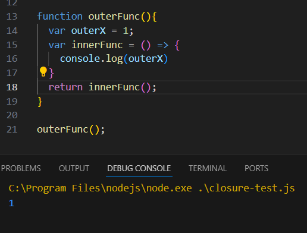

# 클로저

## Closure 클로저

- 클로저 Closure란?
    - 자바스크립트의 고유 개념이 아니라 스칼라, 하스켈 등 함수형 프로그래밍 언어에서 사용되는 특성이다.
    - `A **closure** is the combination of a function bundled together (enclosed) with references to its surrounding state (the **lexical environment**).` - MDN
        - 클로저는 함수와 그 함수가 선언된 환경(렉시컬 환경)의 조합이다.
            - 즉 클로저는 `자신이 선언된 당시의 환경을 기억` 하는 함수
            - 생명주기가 끝난 `외부 함수의 변수에 접근 가능한 내부 함수` 이다.
    - 자바스크립트의 모든 함수는 자신이 선언된 환경의 주소를 저장함.
        - = 상위 스코프의 주소를 가지고 있음.
        - 함수 본문에서 상위 스코프의 주소를 참조하여 외부 함수의 변수에 접근함.
        
        - outerFunc에서 선언된 outerX의 값을 innerFunc에서 사용함.
            
            
            
        
        - innerFunc을 반환하도록 선언되었다면
            - outerFunc은 innerFunc을 반환하고 실행 컨텍스트에서 제거됨
            - 그러나 innterFunc은 여전히 outerFunc의 outerX에 접근하여 값을 불러옴.
            
            
            

- 클로저를 사용하는 이유
    - 상태 유지
        - 현재 상태를 기억하고 변경된 최신 상태 유지 가능
    - 전역 변수의 사용 줄임
        - 전역 변수를 사용하지 않아도 누적 등의 값을 활용 가능
    - 정보의 은닉
        - 외부에서 직접 접근이 불가한 변수로서 값을 관리 가능하다.
    
- 클로저 접근 예시
    - React의 useState
        
        ```jsx
        const MyReact = (function() {
        //_val 변수를 상위 함수 스코프에서 선언.
        // 한 번 실행되고 나면 재접근할 수 없음. -> 하위 스코프 함수 내부에서 접근
          let _val // hold our state in module scope
          return {
            render(Component) {
              const Comp = Component()
              Comp.render()
              return Comp
            },
            // _val 값을 참조하는 하위 스코프 함수
            useState(initialValue) {
              _val = _val || initialValue
              function setState(newVal) {
                _val = newVal
              }
              return [_val, setState]
            }
          }
        })()
        ```
        

- 주의할 점
    - 메모리 관리 측면에서 확인이 요구됨
        - 사용이 종료되지 않았다고 판단하여 상위 스코프의 변수의 메모리 해제가 이뤄지지 않음.
        - 의도적으로 변수 참조를 해제해줄 필요성이 있음.
    - 의도적인 참조 작업
        - 유지보수 측면에서 관리가 어려울 수 있음.

---

### var과 let과 closure

- var VS let
    - 반복문에서 i를 var로 설정할 경우
        
        
        
        - var은 함수 스코프 혹은 전역 스코프를 가지기 때문에 동일한 `i` 에 `arr`내 모든 값이 참조하게 됨.
        - closure 사용 시 주의해야 할 예시임.
    - 반복문에서 i를 let으로 설정할 경우
        
        
        
        - let은 var과 달리 블록 스코프를 가질 수 있기 때문에 해당 블록 내부에서 i에 접근함.
            - for루프의 각 반복에서 `let i`를 생성하여 할당
            - 따라서 `arr`에는 각각의 `i` 값이 담김.

- 다른 방식으로 동일한 작동 유도하기
    
    
    
    - Arrays를 만들고 undefined를 채움
    - forEach를 통해 각 배열의 자리에 i를 채움.
    - 화살표 함수는 부모 스코프에서 i를 캡처 하여 반환 (let과 유사함)

---

https://dmitripavlutin.com/javascript-closure/

https://stackoverflow.com/questions/111102/how-do-javascript-closures-work

https://poiemaweb.com/js-closure

https://enjoydev.life/blog/javascript/6-closure

https://developer.mozilla.org/en-US/docs/Web/JavaScript/Closures

https://medium.com/hcleedev/web-usestate의-동작-원리와-함정-7b4825c16b9

https://well-made-codestory.tistory.com/32