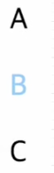
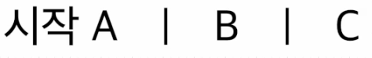

# 1. 가상 클래스 (의사 클래스)

## 1) 가상 클래스란?

가상 클래스 (Pseudo-Class)는 별도의 class를 지정하지 않아도 지정한 것처럼 요소를 선택할 수 있다.

<br>

## 2) 자주 사용되는 가상 클래스의 종류

| 가상클래스     | 내용                                                       |
| -------------- | ---------------------------------------------------------- |
| :hover         | 마우스를 롤오버 했을 때                                    |
| :active        | 마우스를 클릭했을 때                                       |
| :focus         | input 태그 등이 포커스 되었을 때                           |
| :first-of-type | 모든 자식 요소 중에서 첫 번째에 등장하는 특정 요소를 선택  |
| :last-of-type  | 모든 자식 요소 중에서 마지막으로 등장하는 특정 요소를 선택 |
| :first-child   | 모든 자식 요소 중에서 첫 번째에 위치하는 자식을 선택       |
| :last-child    | 모든 자식 요소 중에서 마지막에 위치하는 자식을 선택        |

### first-child vs first-of-type

```html
<div class="parent">
  <span> A </span>
  <p>B</p>
  <p>C</p>
</div>
```

```css
.parent p:first-child {
  color: lightpink;
}

.parent p:first-of-child {
  color: lightskyblue;
}
```

위와 같은 코드가 있을 때, 실행 결과는 아래와 같다.



> **:first-child** 를 사용했을 때 색이 적용되지 않는 이유는 `<p>` 는 부모 `<div>` 의 두번째 자식부터 시작하기 때문에 첫번째 자식인 `<span>`을 건너 뛰고 사용할 수 없다. <br>
> 하지만 **:first-of-type** 은 부모 `<div>` 의 두번째 자식인 `<p>`에 대해 `<p>` 타입 중에는 처음 등장했기 때문에 적용이 가능하다.

<br>

## 3) 자식 결합자 >

### 자식 결합자란?

자식 결합자(>) 는 두 CSS 선택기 사이에 배치되며 첫번째 선택자와 일치하는 요소의 직계 자식인 두 번째 선택자와 일치하는 요소만 일치한다.

### 사용 예시

```html
<div class="container">
  <div></div>
  <div></div>
  <div></div>
  <div></div>
  <div></div>
</div>
```

```css
.container > div {
  width: 100px;
  height: 100px;
  float: left;
  background-color: lightpink;
}

.container > div:last-child {
  width: 300px;
}
```

이렇게 원하는 부분을 선택하여 스타일을 적용할 수 있다.

<br>
<br>
<br>

# 2. 가상 요소 (의사 요소)

## 1) 가상 요소란?

가상 요소 (Pseudo-Element)는 가상 클래스처럼 선택자에 추가되며, 존재하지 않는 요소를 존재하는 것처럼 부여하여 문서의 특정 부분 선택이 가능하다.

## 2) 자주 사용되는 가상 요소의 종류

| 가상 요소      | 내용                                                                                  |
| -------------- | ------------------------------------------------------------------------------------- |
| ::before       | 요소의 콘텐츠 시작 부분에 생성된 콘텐츠를 추가한다.                                   |
| ::after        | 요소의 콘텐츠 끝 부분에 생성된 콘텐츠를 추가한다.                                     |
| ::selection    | 마우스 드래그로 선택한 텍스트 콘텐츠 영역을 선택한다.                                 |
| ::marker       | 목록 아이템 앞에 붙는 마커를 선택한다.                                                |
| ::first-letter | 현재 웹 브라우저에 보이는 상태를 기준으로 요소의 텍스트 콘텐츠 첫 글자를 선택한다.    |
| ::first-line   | 현재 웹 브라우저에 보이는 상태를 기준으로 요소의 텍스트 콘텐츠 첫 줄 내용을 선택한다. |

### 사용 예시

```html
<ul>
  <li>A</li>
  <li>B</li>
  <li>C</li>
</ul>
```

```css
li {
  float: left;
  margin-right: 30px;
  font-size: 32px;
  list-style: none;
}

/* 각 li 다음에 | 추가  */
li::after {
  content: "|";
  padding-left: 30px;
}

/* li 의 가장 마지막 요소의 뒤에 '' 를 선언하여 위에서 선언한 | 제거  */
li:last-of-type::after {
  content: "";
}

/* li 의 가장 첫번째 요소 앞에 '시작' 추가*/
li:first-of-type::before {
  content: "시작";
}
```

#### 위 코드의 실행 결과



**::before** 과 **::after**는 꼭 `content` 와 같이 쓰여야 하며 이 `content`는 가짜 속성이다.

HTML 문서에 정보로 포함되지 않은 요소를 CSS에서 새롭게 생성시켜주는 역할을 한다.
