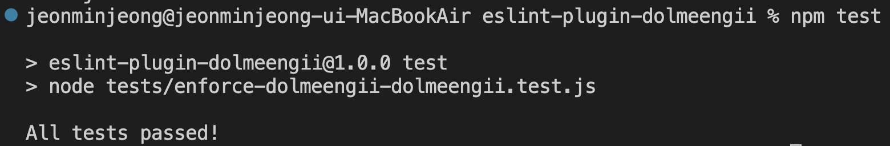

## ESLint 커스터마이징

프로젝트를 개발하다 보면 해당 프로젝트에만 적용되는 규칙과 컨벤션이 필요한 순간이 온다. 이럴 때에 ESLint 커스텀 룰을 적용하여 손쉽게 관리할 수 있다.

### ESLint 커스터마이징 해보기

여기서 커스텀 룰은 ESLint에서 제공하는 기존의 룰의 설정을 바꾸는 것이 아니라, 직접 원하는대로 ESLint 플러그인을 제작하여 사용하는 것을 말한다. <br>
ESLint 공식문서에서 제공하는 방식을 따라 커스터마이징을 해보자.

#### 1️⃣ npm 프로젝트 만들기

```bash
$ mkdir eslint-plugin-dolmeengii
$ cd eslint-plugin-dolmeengii
$ npm init -y
$ touch enforce-dolmeengii-dolmeengii.js
```

<br>

#### 2️⃣ 커스텀 룰 만들기

나는 **변수 `dolmeengii` 가 무조건 값으로 `dolmeengii`를 가질 수 있도록 하는 규칙**을 만들고자 한다.  
디렉토리에 enforce-dolmeengii-dolmeengii.js 라는 파일을 생성해주고, 아래와 같이 규칙을 정의한 코드를 작성한다.

```js
const dolmeengiiRule = {
  meta: {
    type: "problem",
    docs: {
      description:
        "Enforce that a variable named `dolmeengii` can only be assigned a value of 'dolmeegii'.",
    },
    fixable: "code",
    schema: [],
  },
  create(context) {
    return {
      VariableDeclarator(node) {
        if (node.parent.kind === "const") {
          if (node.id.type === "Identifier" && node.id.name === "dolmeengii") {
            if (
              node.init &&
              node.init.type === "Literal" &&
              node.init.value !== "dolmeengii"
            ) {
              context.report({
                node,
                message:
                  'const 로 정의한 변수 이름이 dolmeengii 라면 문자열 "dolmeengii" 이외에는 값을 사용할 수 없다.',
                data: {
                  notDolmeengii: node.init.value,
                },
                fix(fixer) {
                  return fixer.replaceText(node.init, '"dolmeengii"');
                },
              });
            }
          }
        }
      },
    };
  },
};

export default dolmeengiiRule;
```

<br>

#### 3️⃣ 테스트 파일 설정하기

enforce-dolmeengii-dolmeengii 가 잘 동작하는지 확인하는 테스트 코드를 작성해야 한다.

```bash
$ touch enforce-dolmeegnii-dolmeengii.test.js
```

위 명령어를 입력하여 테스트 파일을 만들어준다.

또한 테스트 파일에서 eslint 패키지를 사용해야 하므로 아래의 명령어를 입력한다.

```bash
$ npm install eslint --save-dev
```

이제 package.json에서 테스트를 실행하기 위해 파일에 테스트 스크립트를 추가한다.

```json
// package.json
{
  "name": "eslint-plugin-dolmeengii",
  "version": "1.0.0",
  "type": "module",
  "description": "",
  "main": "index.js",
  "scripts": {
    "test": "node tests/enforce-dolmeengii-dolmeengii.test.js"
  },
  "keywords": [],
  "author": "",
  "license": "ISC",
  "devDependencies": {
    "eslint": "^9.14.0"
  }
}
```

<br>

#### 4️⃣ 테스트 코드 작성하기

```js
// enforce-dolmeengii-dolmeengii.test.js
import { RuleTester } from "eslint";
import dolmeengiiRule from "../rules/enforce-dolmeengii-dolmeengii.js";

const ruleTester = new RuleTester({
  languageOptions: { ecmaVersion: 2015 },
});

ruleTester.run(
  "enforce-dolmeengii-dolmeengii", // rule name
  dolmeengiiRule, // rule code
  {
    // checks
    // 'valid' checks cases that should pass
    valid: [
      {
        code: "const dolmeengii = 'dolmeengii';",
      },
    ],
    // 'invalid' checks cases that should not pass
    invalid: [
      {
        code: "const dolmeengii = 'dolli';",
        output: 'const dolmeengii = "dolmeengii";',
        errors: 1,
      },
    ],
  }
);

console.log("All tests passed!");
```

#### 5️⃣ 테스트 실행하기

다음 명령어를 사용하여 테스트를 실행한다.

```bash
$ npm test
```


테스트가 실행되면 위 이미지와 같은 결과가 터미널에 표시된다.

#### 6️⃣ 플러그인에 사용자 정의 규칙 번들링

index.js 파일을 생성한 후 다음과 같이 작성한다.

```js
import dolmeengiiRule from "./eslint-plugin-dolmeengii/rules/enforce-dolmeengii-dolmeengii.js";
const plugin = { rules: { "enforce-dolmeengii-dolmeengii": dolmeengiiRule } };
export default plugin;
```

#### 7️⃣ 플러그인을 로컬에서 사용하기

npm에 게시하기 전에 플러그인을 테스트하고 싶거나, 플러그인을 사용하고 싶지만 npm에 게시하고 싶지 않을 경우에 플러그인을 로컬에서 테스트해볼 수 있다.
플러그인을 프로젝트에 추가하기 전에 플랫 구성 파일을eslint.config.js 사용하여 프로젝트에 대한 ESLint 구성을 만들어야 한다.

```bash
$ touch eslint.config.js
```

```js
// eslint.config.js
"use strict";

// Import the ESLint plugin locally
import eslintPluginExample from "./eslint-plugin-example";

export default [
  {
    files: ["**/*.js"],
    languageOptions: {
      sourceType: "commonjs",
      ecmaVersion: "latest",
    },
    // Using the eslint-plugin-example plugin defined locally
    plugins: { example: eslintPluginExample },
    rules: {
      "example/enforce-foo-bar": "error",
    },
  },
];
```

이제 규칙을 테스트할 파일을 만들어보자.

```js
// example.js
function correctDolmeengii() {
  const dolmeengii = "dolmeengii";
}

function incorrectDolmeengii() {
  const dolmeegii = "dlin"; // Problem!
}
```

그리고 터미널에서 다음 명령어를 사용하여 테스트 한다.

```bash
$ npx eslint example.js
```

> 결과가 터미널에 떠야 하는데 안 떠서 최종본 업로드 까지 수정하겠음

테스트를 실행하고 잘 적용이 되면 프로젝트에 적용하여 사용하면 된다.

---

---

#### 참고 사이트

[ESLint Custom Rule Tutorial](https://eslint.org/docs/latest/extend/custom-rule-tutorial)
[velog - Custom ESLint Plugin 만들기](https://velog.io/@jyooj08/Custom-ESLint-Plugin-%EB%A7%8C%EB%93%A4%EA%B8%B0-01qkk3wp)
[우아한 테크 - 10분 테코톡 낙타의 ESLint](https://www.youtube.com/watch?v=Be9q0k5BJ_s&t=151s)
