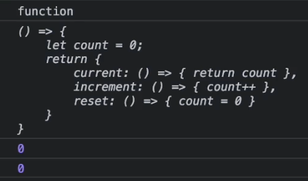
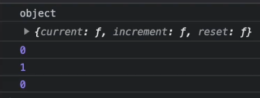

## 1. 함수 표현식 vs 함수 선언문

### 함수 표현식

함수 표현식은 함수를 만들고 변수에 할당하는 경우이다. 함수는 익명이므로 이름이 없다.

```jsx
let funcExpression = function(){
	return 'A function expression 함수 표현식';
}
```

### 함수 선언문

함수 선언문은 함수를 만들고 이름을 지정하는 것이다. function 키워드 다음에 함수 이름을 작성할 때 함수 이름을 선언한다.

```jsx
function funcDeclaration(){
	return 'A function declaration 함수 선언문';
}
```

#### ❗️표현식과 선언문의 차이점
 함수 선언식은 호이스팅에 영향을 받지만, 함수 표현식은 호이스팅에 영향을 받지 않게 된다. 즉, 브라우저가 자바스크립트를 해석할 때 함수 선언식은 호이스팅에 영향을 받기 때문에 맨 위로 끌어올려지게 된다.

```jsx
// Function Expression
alert(foo()); // ERROR! foo wasn't loaded yet
var foo = function () {return 5;}

// Function Declaration
alert(foo()); // Alert 5
function foo() {return 5;} // Declarations are loaded before any code can run.
```
var 문과 유사하게 함수 선언은 다른 코드의 맨 위로 호이스팅된다. 함수 표현식은 정의된 범위에서 로컬 변수의 복사본을 유지할 수 있도록 호이스팅 되지 않는다.

<br>
<br>

## 2. IIFE (Immediately Invoked Function Expression)
### IIFE (즉시 호출 함수 표현식) 이란?
즉시 실행 함수 표현은 정의되자마자 즉시 실행되는 Javascript Fuction 을 말한다.

```jsx
(
	function(){
	
	}
)()
```

첫 번째 소괄호에서는 전역 선언을 막고, IIFE 내부 안으로 다른 변수가 접근하는 것을 막는다. 

두번째 소괄호에서는 즉시 실행함수를 생성한다. 이를 통해 자바스크립트 엔진은 함수를 즉시 해석 및 실행한다.

### IIFE의 주된 사용 목적

IIFE를 사용하는 주된 이유는 변수를 전역으로 선언하는 것을 피하기 위해서이다. 또한, IIFE 내부 안으로 다른 변수들이 접근하는 것을 막을 수도 있다.

```jsx
(
	function(){
		var aName = "Barry";
	}
)();

// IIFE 내부에서 정의된 변수는 외부 범위에서 접근 불가
console.log(aName); // ERORR! aName is not defined

var result = (function (){
	var name = "Barry";
	return name;
})();

console.log(result); // expected output: "Barry"
```

**익명 함수를 위해서도 사용 가능**

function literal은 함수를 정의하는 표현식으로, 다음 예제에서 함수 리터럴을 봐보자.

```jsx
function minus(a, b){
	return a-b;
}
```
> `function` : 예약어 <br>
> `minus`: 함수 이름 (선택사항) <br>
> `(a, b)` : 매개변수 집합 (필수) <br>
> `return a-b;` : 함수 본문 (필수) <br>

익명 함수로 변경하면 함수 이름은 선택사항이라고 했지만 이름이 없어 에러가 뜬다. 이 때, 이름이 없으려면 두 가지 조건을 충족해야한다.   
1️⃣ 이 함수를 할당받을 변수를 지정할 것   
2️⃣ 이 함수를 즉시 호출할 것   

```jsx
// 할당받을 변수 지정
const minus = function (a, b){ 
	return a-b;
}

// 즉시 호출
(function (a,b){
	return a-b;
})()
```

### IIFE에서 연산자
IIFE는 앞에 연산자를 붙여서 사용도 가능하다. 하지만 화살표 함수에서는 무조건 `(` 로 시작해야 한다.
```jsx
!function(){return console.log("hi")}()
void function(){return console.log("hi")}()
+function(){return console.log("hi")}()
-function(){return console.log("hi")}()
~function(){return console.log("hi")}()
*function(){return console.log("hi")}()
^function(){return console.log("hi")}()
&function(){return console.log("hi")}()
```

### IIFE 심화 예제
1️⃣ IIFE를 변수에 할당하면 IIFE 자체는 저장되지 않고, 함수가 실행된 결과만 저장된다.

```jsx
const Score = () => {
	let count = 0;
	return {
		current: () => {return count},
		increment: () => {count++},
		reset: () => {count = 0}
	}
};

console.log(typeof Score);
console.log(Score);

Score().increment();
console.log(Score().current());
Score().increment();
console.log(Score().current());
```



2️⃣ IIFE로 Closure가 가능하게 만든 후에 내부 함수에서 외부함수에 있는 변수를 접근되게 해준다.

```jsx
const Score = (() => {
	let count = 0;
	return {
		current: () => {return count},
		increment: () => {count++},
		reset: () => {count = 0}
	}
})()

console.log(typeof Score);
console.log(Score);

console.log(Score.current());
Score.increment();
console.log(Score.current());
Score.reset();
console.log(Score.current());

```



<br>
<br>

## 3. 순수 함수 (Pure Function)

### Pure Function 이란?

함수형 프로그래밍 패러다임의 한 부분이며, 순수 함수는 두가지 규칙을 가지고 있다.

1️⃣ 같은 입력값이 주어졌을 때, 언제나 같은 결과값을 반환한다.

```jsx
const add = (x, y) => x + y;
console.log(add(10, 20));

const fullName = (fisrt, last) => `${first} ${last}`;
console.log(fullName("John", "Ahn"));
```

2️⃣ 사이드 이펙트를 만들지 않는다.

```jsx
const z = 1;
const sum = (x, y) => x + y + z;
console.log(sum(10, 20));
```

<br>

### Pure Function 을 사용하는 이유는?
1️⃣ 클린 코드를 위해 <br>
2️⃣ 테스트를 쉽게 하기 위해 <br>
3️⃣ 디버그를 쉽게 하기 위해 <br>
4️⃣ 독립적인 코드를 위해 <br>

<br>

### Impure 함수의 예
Pure 함수는 외부에서 선언된 상태를 수정하면 안된다.

**Impure Function**
```jsx
let x = 0;
const numberUp = () => x + 1;
console.log(numberUp());
console.log(x);
```

```jsx
const alphabetArray = ['A', 'B'];
const addItemToArray = (originalArray, newItem) => {
	originalArray.push(newItem);
	return originalArray;
}
console.log(addItemToArray(alphabetArray, 'C'));
console.log(alphabetArray);
```

**Pure Function**
```jsx
let x = 0;
const numberUp = (num) => num + 1;
console.log(numberUp(x));
console.log(x);
```

```jsx
const alphabetArray = ['A', 'B'];
const addItemToArray = (originalArray, newItem) => {
	return [...originalArray, newItem];
}
console.log(addItemToArray(alphabetArray, 'C'));
console.log(alphabetArray);
```

<br>
<br>

## 4. 커링 (Curry Function)

### 커링이란?
함수와 함께 사용하는 고급 기술으로, 다른 언어에도 존재한다. 커링은 `f(a, b, c)` 처럼 단일 호출로 처리하는 함수를 `f(a)(b)(c)` 와 같이 각각의 인수가 호출 가능한 프로세스로 호출된 후 병합될 수 있게 변환하는 것이다. **커링은 함수 호출이 아닌 변환이다.**

<br>

### 코드로 살펴보기
**커링 함수로 변환하기**
```jsx
const sum = (x, y) => x + y;
const curriedSum = x => y => x + y;

console.log(sum(10, 20));
console.log(curriedSum(10));
console.log(curriedSum(10)(20));

const tenPlus = curriedSum(10);
console.log(tenPlus);
console.log(tenPlus(100));
```

```jsx
const makeFood = (ingredient1) => {
	return (ingredient2) => {
		return (ingredient3) => {
			return `${ingredient1} ${ingredient2} ${ingredient3}`
		}
	}
} 

const hamburger = makeFood("Bread")("Ham")("Tomato");
console.log(hamburger);

const cleanerMakeFood = ingredient1 => ingredient2 => ingredient3 => `${ingredient1} ${ingredient2} ${ingredient3}`

const newHamburger = makeFood("Bread")("Ham")("Tomato");
console.log(newhamburger);
```

```jsx
// non-currying
function log(date, importance, message){
	alert(`[${date.getHours()}: ${date.getMinutes()}]: [${importance}] ${message}`);
}

log(new Date(), "DEBUG", "some bug");

// currying
function curry(f){
	return function (a) {
		return function (b) {
			return function (c) {
				return f(a, b, c);
			}
		}
	}
}

const curriedLog = curry(log);
curriedLog(new Date())("DEBUG")("some bug");
```

<br>

**매개변수 개수에 상관없이 커링함수 만드는 방법**
```jsx
function curry(func){
	return function curried(...args) {
		if(args.length >= func.length) {
			return func.apply(this, args);
		} else {
			return function (...args2){
				return curried.apply(this, args, args2);
			}
		}
	}
}

const sum = (x, y, z, j) => x + y + z + j;

const curriedSum = curry(sum);
console.log(curreidSum(1)(2)(3)(4));
```